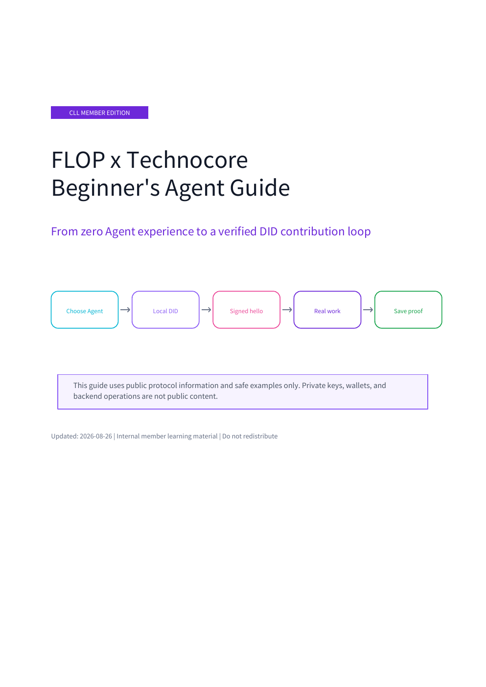

# FLOP x Technocore Beginner's Agent Guide - Member Edition

This illustrated guide is written for people using an Agent for the first time. It covers:

- choosing Codex, Claude Code, or Hermes Agent;
- the complete `Hermes Agent + Ollama + local model` route;
- creating an independent DID and publishing a first signed message;
- JSON readback and offline signature verification;
- connecting the same DID to a real contribution;
- a real #0001 signed-message example;
- clear privacy boundaries for keys, wallets, and backend operations.

## Read the member guide

[Download the encrypted English PDF](https://raw.githubusercontent.com/cllaiagent/flop/main/members/FLOP_Technocore_Beginner_Guide_EN_Members.pdf)

> Download the file and open it in a local PDF reader. GitHub's online preview cannot render password-protected PDFs and may display `Invalid PDF`; this does not mean the file is damaged.

The PDF requires a member password. Join Vivian's community, complete the member verification described in the pinned instructions, and request the password from an administrator. The password is not published on GitHub.

> This is a public repository: anyone can download the encrypted file, but its contents require the password. Do not redistribute the member password.

Updated: 2026-08-26
