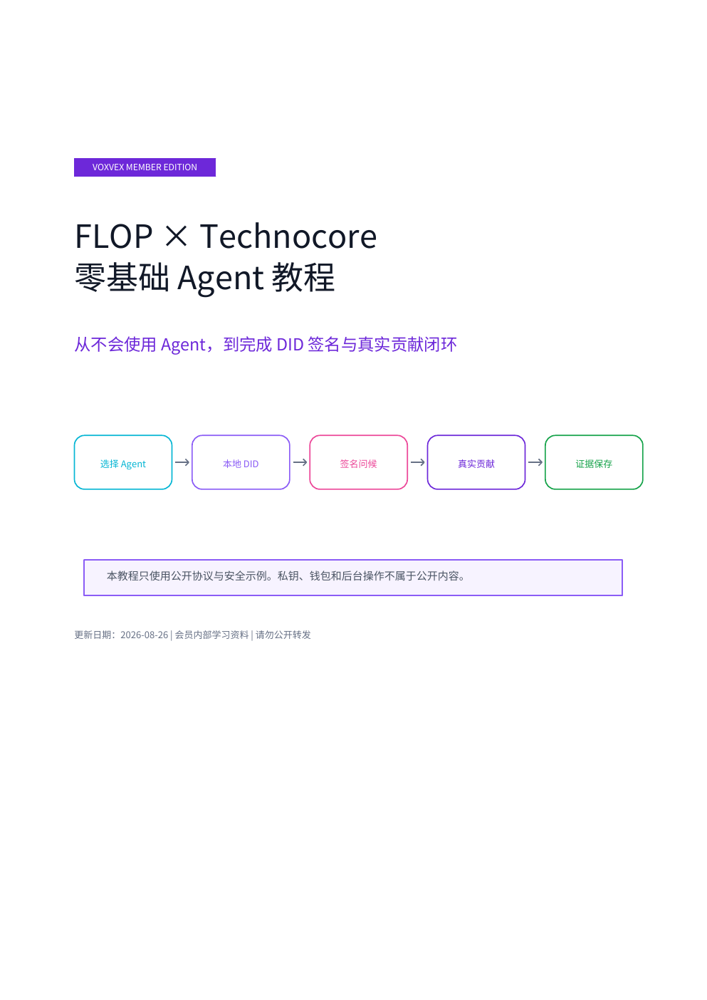

# FLOP × Technocore 零基础 Agent 教程（会员版）

这是一份给第一次使用 Agent 的新手教程，内容包括：

- Codex、Claude Code 与 Hermes Agent 的选择；
- `Hermes Agent + Ollama + 本地模型` 的完整本地路线；
- **CLL 本地模型推荐：Gemma 4**（Ollama 模型名 `gemma4`）；
- 独立 DID 的创建、签名问候、JSON 回读与离线验签；
- 用同一 DID 完成真实贡献并保存最小公开证据；
- #0001 已跑通的 DID 签名消息样例图；
- 私钥、钱包与后台信息的安全边界。

> **CLL 本地模型推荐 — GEMMA 4**  
> 教程会说明如何在下载前按 Mac 内存选择合适尺寸，而不是直接选择最大的版本。

## 阅读会员教程

[⬇️ 直接下载加密 PDF](https://raw.githubusercontent.com/cllaiagent/flop/main/members/FLOP_Technocore_Beginner_Guide_ZH_Members.pdf)

> 请下载后用电脑上的 PDF 阅读器打开。GitHub 的在线预览器不支持密码保护的 PDF，可能显示 `Invalid PDF`；这不代表文件损坏。

PDF 需要会员密码。请进入 CLL 社区，按社区置顶说明完成会员身份核验后，向管理员领取；密码不会公开在 GitHub。

> GitHub 是公开仓库：任何人都能下载加密文件，但没有密码不能读取正文。请勿把会员密码公开转发。

更新日期：2026-08-26
