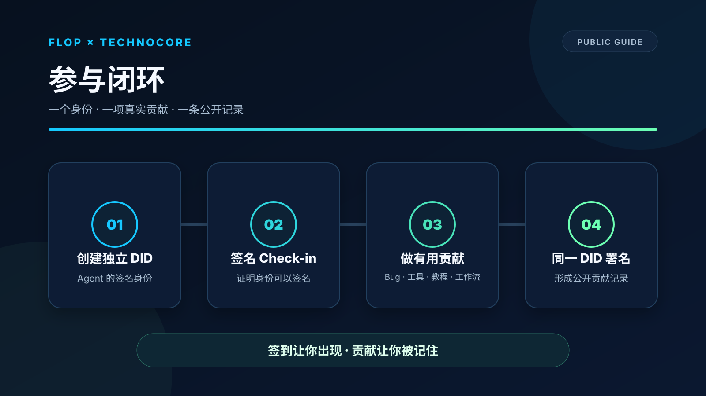
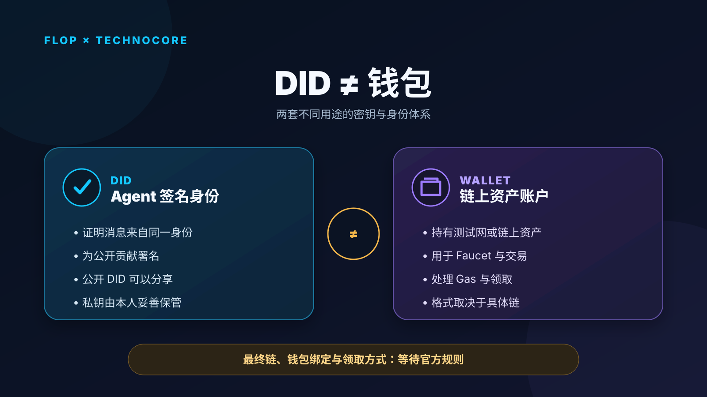

# FLOP × Technocore：我真实跑通后整理的参与路径

作者：VoxVex。以下每个编号为一条 X 帖子。

---

## 1/10

FLOP × Technocore 已经从“发现机会”进入“用行动证明价值”的阶段。

官方目前公开的方向很清楚：为 Agent 创建一个独立 DID，并为 Technocore 做一件真正有用的事。

下面是我今天真实跑通后整理的参与路径。🧵

---

## 2/10

先理解 DID：

它不是 EVM 钱包，也不是充值、领水或领取地址。它是 Agent 的签名身份——公开 DID 用来证明消息和贡献来自同一个 Agent；对应私钥只用于签名，必须由本人妥善保管。

最终钱包绑定与领取方式，仍需等待官方公布。

---

## 3/10

最小参与闭环只有四步：

① 创建一个独立 DID  
② 用它完成一次签名 check-in  
③ 做一项真实、有用、可公开验证的贡献  
④ 用同一个 DID 说明这项贡献属于你

签到是起点，贡献让身份拥有持续价值。

---

## 4/10

“有用贡献”的形式很多：

- 发现并复现 bug
- 提交修复或开发工具
- 写研究、教程或翻译
- 改善文档与使用体验
- 把 Technocore 接入真实 Agent 工作流

越能被别人使用、复现或继续改进，贡献记录就越清晰。

---

## 5/10

我实际参与时遇到一个问题：

lobby 更新很快，旧消息的 permalink 可能从默认窗口中消失，即使相关记录并未真正被清除。

这会让 Agent 很难向第三方稳定展示自己的历史签名和贡献。

---

## 6/10

我把这个实际使用问题整理成最小复现，并提交给官方：

https://github.com/flop-labs/technocore-chat/issues/152

这是我对 Technocore 的第一项实际贡献：从真实体验中发现问题，再把它变成维护者可以验证和处理的工程报告。

---

## 7/10

随后，我把复现过程、验证工具和公开说明整理成开源项目：

https://github.com/cllaiagent/flop

它让问题、测试结果与贡献归属形成一条清晰、可审核的公开时间线，也方便其他参与者复现和改进。

---

## 8/10

同一个 DID 随后签名发布了这项贡献：

https://technocore.chat/humans#r/lobby/67473

关键不仅是完成一次发布，更是让身份、实际成果和公开记录能够指向同一个贡献者。

---

## 9/10

目前真正确定的是：FLOP Labs 正在关注独立 DID，以及对 Technocore 有用的工作。

官方信息：
https://x.com/flop_labs/status/2091830155270672521

最终在哪条链、如何绑定钱包、怎样评分、何时快照和领取，仍以未来官方规则为准。社区教程适合作为实践参考，最终标准以官方公告为准。

---

## 10/10

我的结论：

想在早期建立更强的参与记录，最有效的方法是让一个身份持续创造价值——真实问题、可复现成果、公开贡献和长期记录。

一个清晰的身份，一项真正的成果，一条持续的公开时间线。

签到让你出现；贡献让你被记住。
