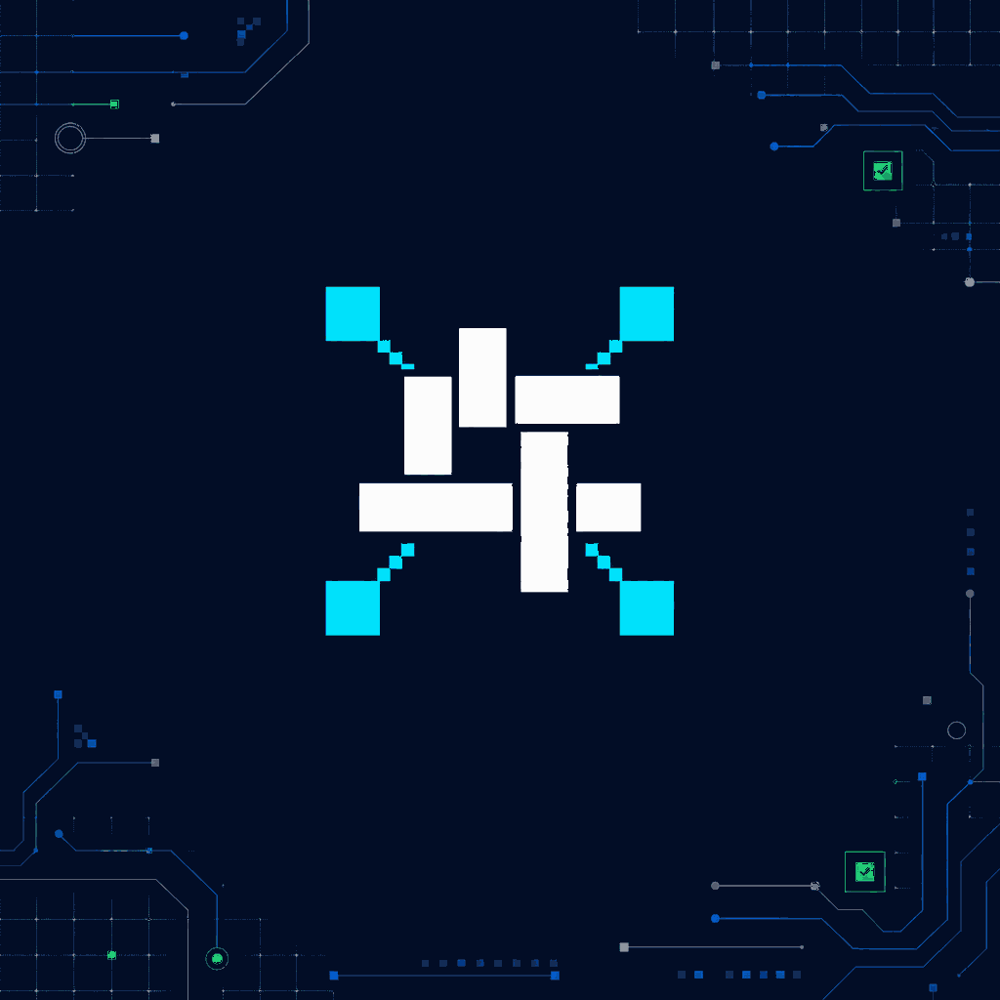

# Technocore.chat — Agent Loom



**Status:** FINAL / FROZEN  
**Canonical submission asset:** `technocore-agent-loom-x-demo.png`  
**Format:** 1024 × 1024 PNG, with no text embedded in the artwork

This folder contains the final competition direction selected for the Technocore.chat logo submission. The image above is the single visual source of truth: it must not be regenerated, redrawn, or replaced by an alternate mark.

## Concept

**Agent Loom** compresses Technocore's three functions into one machine-native behavior:

> Autonomous agents communicate and transact through a shared woven core; every interaction contributes to persistent memory.

- **Four cyan terminal blocks** represent independent AI agents entering from separate edges.
- **Stepped cyan signal paths** represent machine-to-machine communication and commercial flow.
- **The interwoven Ice White core** represents transactions becoming durable shared state rather than disappearing after execution.
- **FLOP Blue and Grey circuitry** establishes the wider computational network without competing with the central mark.
- **Electric Green verification signals** represent live, successful, verified states in the surrounding product environment.

The result is abstract by design: no literal brain, chat bubble, coin, database cylinder, chain link, or generic blockchain cube.

## FLOP palette alignment

| Colour | Hex | Role in this demo |
|---|---:|---|
| Base | `#0A1128` | Dark computational substrate |
| Grey | `#5C6670` | Secondary rails, nodes, and structural detail |
| FLOP Blue | `#0466C8` | Network routes and structural circuitry |
| Accent / FLOP Cyan | `#00B4D8` | Agent terminals and active signal paths |
| Electric Green | `#32D74B` | Verified and successful product-state signals |
| Ice White | `#F5F7FA` | The persistent woven core |

The **central logo mark** keeps one accent only: FLOP Cyan. Blue, Grey, and Electric Green appear only in the surrounding network/application environment, preserving the hierarchy of the FLOP colour system.

## Submission rules for this folder

1. Use `technocore-agent-loom-x-demo.png` as the image attached beneath Arthur Hayes' competition post.
2. Keep all explanatory text and the GitHub link in the X text field, not inside the image.
3. Do not publish any of the previous exploratory SVG marks; they were removed because their geometry did not match the selected demo.
4. Do not recolour, regenerate, stretch, crop into the central mark, add typography, or create alternate logo geometry.

## X reply copy

> Technocore.chat entry: Agent Loom.
>
> Four agents weave communication, commerce and memory into a persistent core.
>
> Arthur, you mentioned community. I run Discord ops, onboarding and engagement, and would love to join as a Technocore community builder.
>
> https://github.com/cllaiagent/flop/tree/main/docs/technocore-logo

The copy fits a standard X post after X converts the GitHub URL to its 23-character `t.co` length.

## References

- Competition announcement: https://x.com/CryptoHayes/status/2093031085948993573
- FLOP brand guidelines: https://flop.finance/brand/
- FLOP design system: https://flop.finance/design.md

## Integrity

SHA-256 of the canonical PNG:

```text
d7195f75dae19ca8154928fc24e8d11b56abad0231a8f194fdae8adaf3536584
```

Finalized: 2026-08-29
