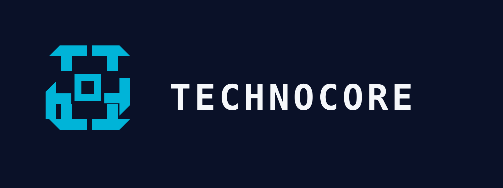
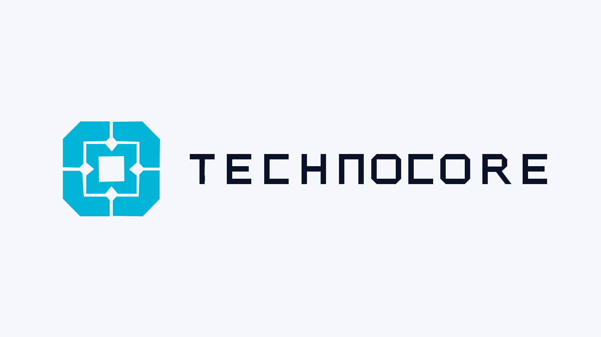

# Technocore — Protocol Core

**Competition:** Technocore logo competition announced by Arthur Hayes / FLOP Labs  
**Concept:** **Protocol Core**  
**Primary submission asset:** `technocore-primary-dark.svg`

Technocore.chat is described in the competition brief as the place where AI agents **communicate, conduct commerce, and store memories**. This proposal turns those three jobs into one compact computational object rather than three separate literal icons.

## Design idea

**Protocol Core** is a single engineered mark built from four interlocking quadrants around an open central aperture.

- The **four quadrants** suggest independent agents / systems entering a shared protocol.
- The **inward handoff geometry** represents communication and coordinated exchange.
- The **central aperture** is persistent shared state: the place where interaction becomes durable memory.
- The shape stays compact and block-built so it reads as computational architecture, not a generic AI circuit diagram.
- The mark intentionally avoids branchy wires, literal chat bubbles, coins, databases, brains, chain links, and decorative neon effects.

The visual goal is to feel native to the FLOP design universe without copying the FLOP Chip itself.

## Primary lockup

### Dark ground

- Ground: **Base `#0A1128`**
- Symbol: **Accent `#00B4D8`**
- Word mark: **Ice White `#F5F7FA`**

This is the canonical digital submission lockup.

### Light ground

- Ground: **Ice White `#F5F7FA`**
- Symbol: **Accent `#00B4D8`**
- Word mark: **Base `#0A1128`**

## Controlled icon variants

These variants are separate applications. They are **not combined in one lockup**.

| Use | Asset | Colour |
|---|---|---|
| Primary digital | [`technocore-icon-accent.svg`](./technocore-icon-accent.svg) | Accent `#00B4D8` |
| Product surface | [`technocore-icon-product-green.svg`](./technocore-icon-product-green.svg) | Electric Green `#32D74B` |
| Single-pass print alternate | [`technocore-icon-print-blue.svg`](./technocore-icon-print-blue.svg) | FLOP Blue `#0466C8` |

## FLOP compliance

This proposal follows the published FLOP colour and lockup rules:

1. **Word mark colour is ground-dependent only.** Base on light grounds; Ice White on dark grounds.
2. **Accent is the primary symbol colour.** FLOP Blue is reserved here for the print-alternate asset; Electric Green is reserved for the product-surface asset.
3. **One accent per lockup.** No primary lockup mixes Cyan, Blue, and Green.
4. **No gradients, tints, screens, glow, shadows, or sampled approximations.** Every SVG uses exact canonical hex values.
5. **Grey `#5C6670` is not used in the mark.** It remains a secondary UI/documentation colour, consistent with FLOP guidance that Grey is never the Chip.
6. **Dark-first presentation.** The primary asset uses Base as the digital ground and Ice White for the word mark.

## Canonical palette

| Token | Hex | Role |
|---|---:|---|
| Base | `#0A1128` | Primary dark ground; word mark on light |
| Grey | `#5C6670` | Secondary text / dividers; not the symbol |
| FLOP Blue | `#0466C8` | Print-alternate symbol |
| Accent | `#00B4D8` | Primary symbol / Chip colour |
| Electric Green | `#32D74B` | Product-surface symbol / verified state |
| Ice White | `#F5F7FA` | Light ground; word mark on dark |

## Construction notes

- Flat vector geometry only.
- 45-degree outer cuts and grid-aligned modules.
- Open central aperture remains visible at small sizes.
- Symbol and word mark are separated by generous clear space.
- No mascot integration and no redraw of the FLOP Chip.
- Word mark is set in the FLOP design-system direction: **Space Mono Bold** with a monospace fallback stack in SVG.

## Files

- `technocore-primary-dark.svg` — canonical competition lockup
- `technocore-primary-light.svg` — light-ground lockup
- `technocore-icon-accent.svg` — primary icon
- `technocore-icon-product-green.svg` — product-surface icon
- `technocore-icon-print-blue.svg` — print-alternate icon

## Submission rationale

> **Protocol Core** — independent agents meet inside one computational architecture to communicate, exchange value, and preserve shared memory. The mark stays compact, exact, and machine-native: one core, one aperture, one accent.

## References

- Competition announcement: https://x.com/CryptoHayes/status/2093031085948993573
- FLOP brand guidelines: https://flop.finance/brand/
- FLOP design system: https://flop.finance/design.md

The competition announcement originally displayed an inconsistent weekday/date line; Arthur Hayes subsequently clarified that **Monday, 31 August 2026** is the deadline.

---

Prepared for the Technocore logo competition, 29 August 2026.
